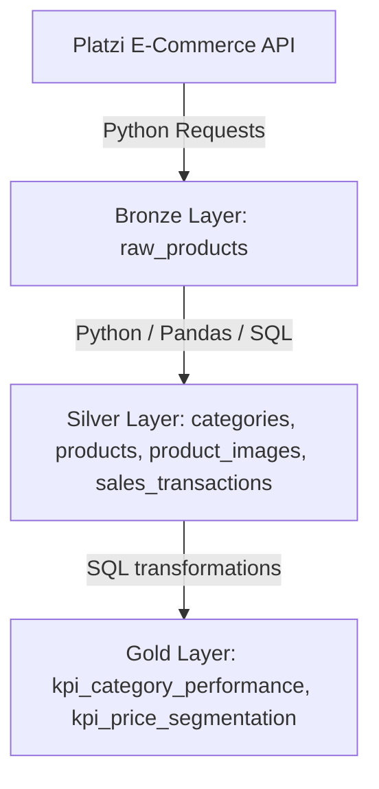

# E-Commerce Medallion Architecture Data Platform

A production-grade E-Commerce Data Engineering pipeline built on PostgreSQL and Python. This project demonstrates modern **Lakehouse/Medallion Architecture** patterns by transforming raw API ingestion data through sequential quality stages (Bronze, Silver, and Gold) to compute enterprise-level business KPIs.

## 🏗️ Architecture



### 🥉 Bronze Layer (Raw Ingest)
- **Ingestion**: Raw JSON payloads fetched directly from the E-Commerce API.
- **Transformations**: None. Preserves absolute source fidelity.
- **Metadata**: Ingestion timestamps are appended.
- **Storage**: `bronze.raw_products` (PostgreSQL `JSONB` column type for flexibility and query optimization).

### 🥈 Silver Layer (Cleaned & Relationalized)
- **Transformations**: Flattened JSON structures, parsed data types, handled missing values, and validated schema constraints.
- **Deduplication**: Records sorted by category and product modification timestamps to deduplicate and persist only the latest snapshots.
- **Data Enrichment**: Automatically simulates e-commerce transactional sales over the past 30 days (`silver.sales_transactions`) to enable business KPI analysis.
- **Storage**: Standard normalized tables:
  - `silver.categories`
  - `silver.products`
  - `silver.product_images`
  - `silver.sales_transactions`

### 🥇 Gold Layer (Business Intelligence / KPIs)
- **Transformations**: Computes aggregations, business metrics, and dimensions directly inside PostgreSQL using high-performance SQL.
- **Storage**:
  - `gold.kpi_category_performance`: Aggregated catalog volume, pricing, sales quantities, and total revenue per category.
  - `gold.kpi_price_segmentation`: Categorization of sales metrics into price tiers: **Budget** ($\le \$20$), **Mid-Range** ($\$20 < \text{Price} \le \$100$), and **Premium** ($> \$100$).

---

## 🧰 Tech Stack
- **Python**: Ingestion, cleaning, transformation logic, and simulation.
- **PostgreSQL**: Lakehouse storage, relational mapping, schema isolation, and analytical aggregates.
- **SQL / DDL**: Relational schemas, data constraints, indexing, and window functions.
- **Pandas**: Efficient flattening, data type casting, and deduplication logic.
- **SQLAlchemy**: Safe session pool management and connection interface.

---

## 📂 Project Structure
```
├── requirements.txt         # Project package requirements
├── .env                     # Configuration file for Database & API URLs
├── run_pipeline.py          # Orchestration pipeline entrypoint
├── src/
│   ├── config.py            # Configuration loader
│   ├── db.py                # Database engine setup & schema init
│   ├── extract.py           # Ingest API -> Bronze Layer
│   ├── transform_silver.py  # Standardize and Relationalize -> Silver Layer
│   └── transform_gold.py    # Compute analytical KPIs -> Gold Layer
└── sql/
    ├── ddl_bronze.sql       # Bronze DDL schema
    ├── ddl_silver.sql       # Silver DDL schema
    └── ddl_gold.sql         # Gold DDL schema
```

---

## 🚀 How to Run

### 1. Prerequisites
- **Python 3.8+**
- **PostgreSQL instance**

### 2. Install Dependencies
```bash
python3 -m venv .venv
source .venv/bin/activate
pip install -r requirements.txt
```

### 3. Setup Configuration
Create a `.env` file in the root directory (based on `.env.example`):
```env
DATABASE_URL=postgresql://<username>:<password>@<host>:<port>/<dbname>
API_URL=https://api.escuelajs.co/api/v1/products
```

### 4. Run the Pipeline
Execute the pipeline orchestrator:
```bash
python run_pipeline.py
```

---

## 📊 Analytics Results (Gold Layer)

### Category Performance KPI
Provides sales and catalog statistics aggregated by product categories.

| Category ID | Category Name  | Product Count | Average Price ($) | Total Qty Sold | Total Revenue ($) |
| :---------- | :------------- | :------------ | :---------------- | :------------- | :---------------- |
| 1           | Clothes        | 33            | 183.60            | 5,658          | 1,060,271.00      |
| 2           | Electronics    | 9             | 43.58             | 1,202          | 51,759.00         |
| 3           | Furniture      | 5             | 58.20             | 707            | 40,810.00         |
| 4           | Shoes          | 8             | 190.03            | 1,481          | 295,093.00        |
| 5           | Miscellaneous  | 5             | 53.33             | 836            | 44,435.00         |

### Price Segmentation KPI
Categorizes catalog distribution and generated revenue based on product price tiers.

| Price Segment | Product Count | Average Price ($) | Total Revenue ($) |
| :------------ | :------------ | :---------------- | :---------------- |
| Budget        | 12            | 10.58             | 23,408.00         |
| Mid-Range     | 41            | 63.12             | 404,404.00        |
| Premium       | 7             | 819.64            | 1,064,556.00      |
# ecommerce-data-platform-medallion-architecture
